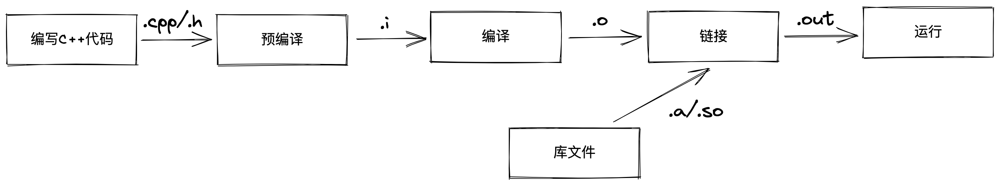

# 1.4 程序创建的技巧
## 编写和运行一个C++文件
* 使用文本编辑器编写程序的代码，并保存为`.cpp`文件，这个文件就是我们的源代码。
* 预编译，这一步执行文件中以`#`开头的预处理指令，比如`#include`，`#define`，`#line`，`#if`，`#else`等。这些指令并非C++语句，所以不会以`;`结尾，这一步我们将得到`.i`文件
* 编译源代码，将`.cpp`文件内的C++代码翻译成机器可以理解的机器语言，存储在`.s`文件中。这一步得到的代码叫做汇编代码，是ASCII码文件，依然是人可以读懂的文字编码形式。
* 汇编，将汇编代码转换成机器指令，得到`.o`文件，此时我们得到的是二进制文件，存放的是机器指令，但依然不能运行，还需要经过链接。
* 链接，将所有的`.o`文件和库链接在一起。库分为静态库和动态库两种，在linux下分别是`.a`和`.so`文件，windows下是`.lib`和`.dll`文件。最终我们的得到文件就是我们的可执行文件，在linux下为`.out`，在windows中则是`.exe`文件。

下图展示了Linux下的一个cpp文件的创建和执行过程：


## 编译
### 命令
```shell
g++ filename.cpp -o filename.out
```
可以不指定`-o`，Linux下默认产生`a.out`文件。

### 编译器
* GCC(GNU Compiler Collection)是GNU编译器的集合，其中gcc和g++是两种常见命令而非编译器，二者从定义上来说都是驱动，负责调用编译器。
* gcc为`.c`文件调用c编译器`cc1`，为`.cpp`调用c++编译器`cc1plus`，默认不会链接c++的标准库。
* g++将`.c`和`.cpp`文件都当作cpp语言并统一调用`cc1plus`.
* clang++是mac上的一个轻量编译器，用于C，C++，Objective-C，Objective-C++，相较于gcc速度较慢。

### make和cmake
当我们开发一个C++工程的时候，由于文件很多，我们如果一个个去编译文件的话工程量会很大，所以我们采用make和cmake对整个项目进行自动化的编译。
* make是一个文件编译的批处理工具，它本身并不能执行编译链接操作，而是通过在makefile文件中的命令来进行编译和链接。
* makefile包含了调用编译器来执行编译的命令，当工程比较小的时候可以手写，但如果工程很大，那么手写就变得非常麻烦，并且当我们在不同平台操作可能又需要修改makefile，所以我们就需要Cmake这个工具了。
* Cmake是一个跨平台的makefile生成工具，根据项目中的CmakeLists.txt文件来生成makefile文件。
* CmakeLists.txt文件则需要用户手写，告知Cmake如何生成makefile。

注意：程序能够通过某个编译器的编译并不意味着它就是合法的C++程序；同样，程序不能通过某个编译器的编译也并不意味着它就1是非法的C++程序。